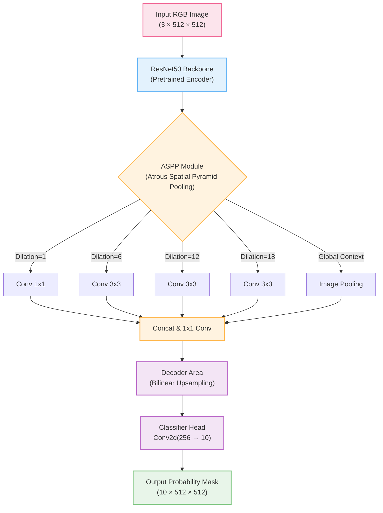

# 🏜️ Off-Road Desert Semantic Segmentation

> **High-performance pixel-wise scene understanding for autonomous off-road navigation in desert environments**

A production-grade semantic segmentation system built with **DeepLabV3+ (ResNet50)** that classifies synthetic desert terrain into **10 semantic classes**. Engineered for the **Duality AI Offroad Autonomy Segmentation Challenge** with optimized IoU performance and an efficient training pipeline.

---

## 🎯 Project Overview

| Feature | Details |
|---------|---------|
| **Model** | DeepLabV3+ with pretrained ResNet50 backbone (COCO weights) |
| **Classes** | 10 (Trees, Lush Bushes, Dry Grass, Dry Bushes, Ground Clutter, Flowers, Logs, Rocks, Landscape, Sky) |
| **Input** | RGB images (Resized to 512×512 for fine-grained object detection) |
| **Output** | Pixel-wise segmentation masks (10 classes) |
| **Loss** | Class-Weighted Dice (50%) + OHEM Focal Loss (50%, γ=2.0) + Boundary Loss |
| **Optimizer** | AdamW + CosineAnnealingWarmRestarts (for escaping local minima) |
| **Augmentations** | A.Compose (RandomResizedCrop 0.3-1.0, ElasticTransform, CLAHE, GridDistortion, CoarseDropout) |
| **Key Metric** | Mean IoU (Excluding empty Background class) |
| **Dataset** | 2,857 train + 317 val synthetic desert images from Falcon digital twin |

---

## 🏗️ Architecture: DeepLabV3+ with ResNet50

The model uses an encoder-decoder structure designed to capture context at multiple scales (crucial for distinguishing vast skies vs. tiny desert flowers).



---

## 🚀 Phase-Wise Development Guide

### Phase 1: Environment Setup & Data Preparation

Getting the environment ready and preparing the massive synthetic dataset.

**1. Create the Environment**
```bash
# Create and activate virtual environment
python3 -m venv EDU_env
source EDU_env/bin/activate

# Install dependencies (PyTorch, Albumentations, etc.)
pip install -r requirements.txt
```

**2. Fast Data Loading via LUT (Look-Up Table)**
Raw masks are 16-bit with values like 7100, 10000. Instead of looping through each pixel, we utilize a precomputed lookup table, doing this in O(1) time:
```python
_MASK_LUT = np.zeros(10001, dtype=np.uint8)  # Built once at import
mask = _MASK_LUT[arr]                        # Single vectorized lookup
```

**3. Data Augmentation Strategy**
We utilize aggressive augmentations tailored for desert environments:
*   **Scale-Aware (RandomResizedCrop 0.3-1.0)**: Forces the model to learn objects at varying distances (critical for tiny Logs/Rocks).
*   **Photometric (CLAHE, Brightness Contrast)**: Simulates dawn/noon/dusk lighting and enhances contrast of brown desert terrain.
*   **Deformable (ElasticTransform, GridDistortion)**: Learns adaptable boundaries for organic shapes like bushes and rocks.

---

### Phase 2: Initial Training (The Base Model)

Training the baseline model to establish solid performance on dominant classes.

**Run Initial Training:**
```bash
# Train from scratch (35 epochs, batch=12, effective batch=24 with grad accumulation)
# Automatically uses OneCycleLR for super-convergence
python train.py --epochs 35 --batch 12
```

**Key Technical Decisions in Phase 2:**
*   **DeepLabV3+ with ResNet50**: Fast epoch times (~10 mins on Mac/MPS, ~3 mins on Colab T4) allowing rapid iteration. ASPP modules capture context at multiple scales (sky vs. tiny rocks).
*   **Disabled Auxiliary Classifier**: To save compute overhead and memory during initial sweeps.
*   **Class Weight Strategy**: Computed via *sqrt-inverse frequency* to gently upweight rare classes without causing gradient explosion.

At the end of this phase, the model achieves ~**0.51 mIoU**, performing exceptionally on Sky (0.97) and Trees (0.60), but struggling with rare, visually confusing classes like Ground Clutter (0.28) and Logs (0.32).

---

### Phase 3: Fine-Tuning & IoU Optimization (Advanced Techniques)

Pushing the mIoU towards 0.60+ by specifically attacking the weakest classes with an aggressive training strategy. 

**Run Fine-Tuning (Resume Checkpoint):**
```bash
# Resume from the best checkpoint with the Round 3 configuration
python train.py --epochs 60 --resume checkpoints/best_model.pth --batch 12
```

**Round 3 Advanced Techniques:**

1.  **Resolution Bump (448 → 512)**: Increases spatial detail for tiny objects (Logs, Rocks, Clutter).
2.  **Class-Weighted Dice Loss**: Standard Dice Loss averages equally over all active classes. We modified it to aggressively multiply the gradients of rare classes (Logs get 2.5× weight).
3.  **OHEM Focal Loss**: Online Hard Example Mining only backpropagates through the *hardest 50%* of pixels in each batch, stopping easy classes (Sky) from drowning out the signal.
4.  **Boundary-Aware Loss**: Calculates a Sobel-like edge map on the fly and doubles the cross-entropy penalty on class boundaries (where most segmentation errors occur).
5.  **Warm Restarts Scheduler**: CosineAnnealingWarmRestarts resets the learning rate every 10 epochs, violently jerking the model out of local minima to find better generalizable weights.
6.  **Background Metric Exclusion**: Modifying the pipeline to completely ignore `Class 0 (Background)` inside mIoU calculations since it possesses 0 pixels, presenting a truer performance picture.

---

### Phase 4: Evaluation, Visualization & Deployment

Assessing the model and preparing it for real-world inference.

**Evaluate the Results:**
```bash
# Evaluate on validation set
python test.py

# Evaluate with Test-Time Augmentation (TTA) — averages predictions across flips/scales
# Yields +2-4% IoU boost (at the cost of 3x inference time)
python test.py --tta
```

**Visualize the Workflow:**
```bash
# Generate Loss, IoU, LR curves, and Per-Class Bar Charts
python visualize.py
```

**Expected Evaluation Outputs:**
| File | Description |
|------|-------------|
| `predictions/masks_raw/` | Raw class-index masks (1-10) for downstream robotics systems |
| `predictions/masks_color/` | RGB colored masks mapped to standard palette |
| `predictions/comparisons/` | Input → Ground Truth → Prediction (side-by-side) |
| `predictions/confusion_matrix.png` | Tells you exactly what classes are confused (e.g., Dry Bushes vs. Dry Grass) |

---

## ⚙️ System Configuration Reference

### Classes (10 Total)

| ID | Class | Pixel Value | Color | Strategy Focus |
|----|-------|-------------|-------|----------------|
| 1 | Trees | 100 | 🟢 Forest Green | |
| 2 | Lush Bushes | 200 | 🟩 Lime | CLAHE contrast |
| 3 | Dry Grass | 300 | 🟫 Tan | |
| 4 | Dry Bushes | 500 | 🟤 Brown | Elastic Distortions |
| 5 | Ground Clutter | 550 | 🫒 Olive | OHEM + 2.5x Weight |
| 6 | Flowers | 600 | 💗 Deep Pink | |
| 7 | Logs | 700 | 🟫 Saddle Brown | 0.3x Crop + 2.5x Weight |
| 8 | Rocks | 800 | ⬜ Gray | 512x512 Res + 2.0x Weight|
| 9 | Landscape | 7100 | 🟤 Sienna | |
| 10 | Sky | 10000 | 🔵 Sky Blue | |

### Hardware Requirements & Auto-Detection

| Requirement | Minimum | Recommended |
|-------------|---------|-------------|
| Python | 3.9+ | 3.10+ |
| PyTorch | 2.0+ | 2.2+ |
| RAM | 8 GB | 16 GB |
| GPU/Accelerator | Optional (CPU) | CUDA GPU / Apple Silicon (MPS) |

The system automatically selects the best instance:
`CUDA (NVIDIA GPU) → MPS (Apple Silicon) → CPU (fallback)`

---

## 📝 License

This project is built for the **Duality AI Offroad Autonomy Segmentation Challenge** (educational/hackathon purposes).
