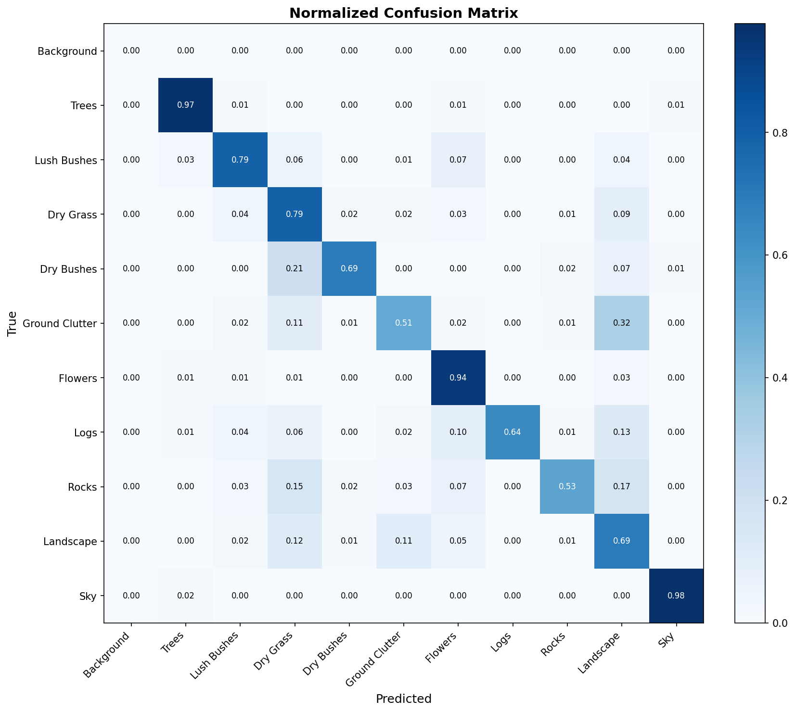
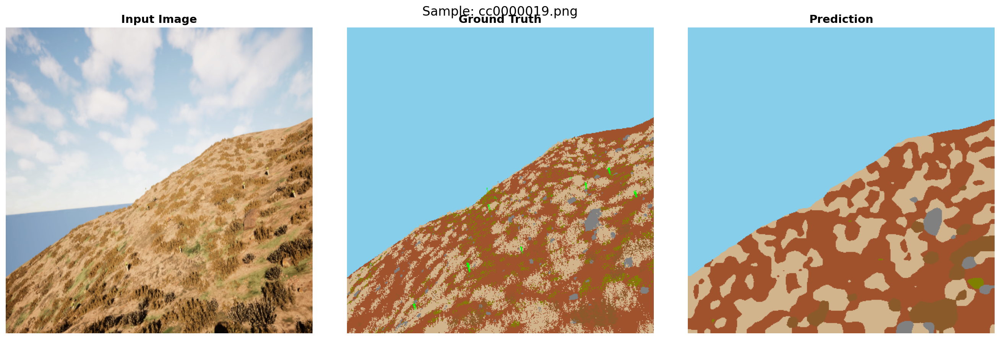
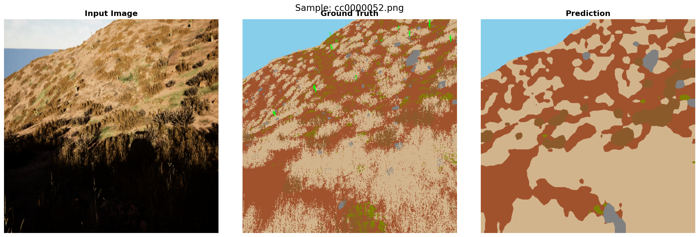
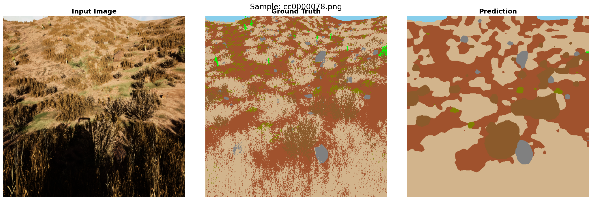
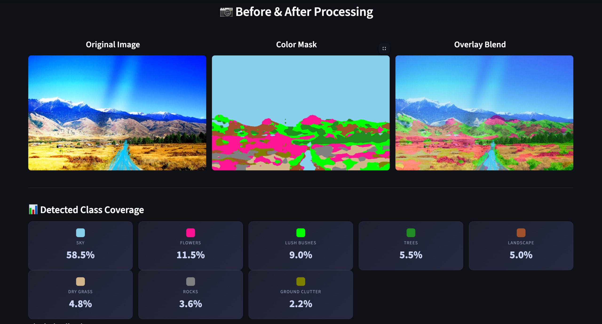
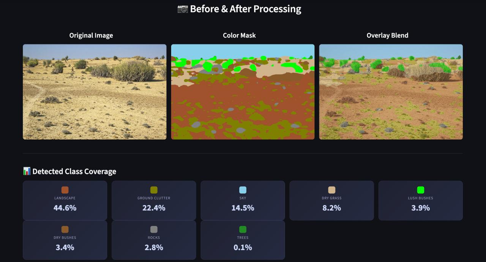

<div align="center">

# CRYPT-AI

### Off-Road Desert Semantic Segmentation

** Team FORGECRYPT**

[](https://python.org)
[](https://pytorch.org)
[](https://duality.ai)
[](https://arxiv.org/abs/1802.02611)

---

> **Pixel-perfect scene understanding for autonomous off-road navigation in harsh desert environments.**
>
> Built for the **Duality AI Offroad Autonomy Segmentation Challenge** — classifying synthetic desert terrain into **10 semantic classes** using DeepLabV3+ with a ResNet50 backbone, advanced loss engineering, and aggressive augmentation strategies.

---

</div>

## Table of Contents

- [Project Overview](#-project-overview)
- [Architecture](#-architecture)
- [Methodology — Phase-Wise Development](#-methodology--phase-wise-development)
  - [Phase 1: Environment Setup & Data Preparation](#phase-1-environment-setup--data-preparation)
  - [Phase 2: Baseline Training](#phase-2-baseline-training--the-foundation)
  - [Phase 3: Fine-Tuning & IoU Optimization](#phase-3-fine-tuning--iou-optimization)
  - [Phase 4: Evaluation & Deployment](#phase-4-evaluation-visualization--deployment)
- [Results & Performance Metrics](#-results--performance-metrics)
- [Segmentation Results — Visual Comparisons](#-segmentation-results--visual-comparisons)
- [Challenges & Solutions](#-challenges--solutions)
- [Getting Started](#-getting-started)
- [License](#-license)

---

## Project Overview

| Feature | Details |
|:--------|:--------|
| **Team** | 🔥 **FORGECRYPT** |
| **Project** | CRYPT-AI — Off-Road Desert Semantic Segmentation |
| **Model** | DeepLabV3+ with pretrained ResNet50 backbone (COCO weights) |
| **Classes** | 10 (Trees, Lush Bushes, Dry Grass, Dry Bushes, Ground Clutter, Flowers, Logs, Rocks, Landscape, Sky) |
| **Input** | RGB images resized to 512×512 |
| **Output** | Pixel-wise segmentation masks (10 classes) |
| **Loss** | Class-Weighted Dice (50%) + OHEM Focal Loss (50%, γ=2.0) + Boundary Loss |
| **Optimizer** | AdamW + CosineAnnealingWarmRestarts |
| **Dataset** | 2,857 train + 317 val synthetic desert images (Falcon digital twin) |
| **Key Metric** | Mean IoU (excluding empty Background class) |

### 🎨 Semantic Class Palette

| ID | Class | Pixel Value | Color | Strategy Focus |
|:--:|:------|:-----------:|:-----:|:---------------|
| 1 | Trees | 100 | 🟢 Forest Green | High baseline IoU |
| 2 | Lush Bushes | 200 | 🟩 Lime | CLAHE contrast enhancement |
| 3 | Dry Grass | 300 | 🟫 Tan | Texture-based differentiation |
| 4 | Dry Bushes | 500 | 🟤 Brown | Elastic distortions |
| 5 | Ground Clutter | 550 | 🫒 Olive | OHEM + 2.5× weight |
| 6 | Flowers | 600 | 💗 Deep Pink | Color-based detection |
| 7 | Logs | 700 | 🟫 Saddle Brown | 0.3× crop + 2.5× weight |
| 8 | Rocks | 800 | ⬜ Gray | 512px resolution + 2.0× weight |
| 9 | Landscape | 7100 | 🟤 Sienna | Dominant terrain class |
| 10 | Sky | 10000 | 🔵 Sky Blue | Near-perfect segmentation |

---

## Architecture

The model uses an **encoder-decoder** structure (DeepLabV3+) designed to capture context at multiple spatial scales — crucial for distinguishing vast skies from tiny desert flowers.

```
┌─────────────────────────────────────────────────────────────────────┐
│                        CRYPT-AI Architecture                        │
├─────────────────────────────────────────────────────────────────────┤
│                                                                     │
│   Input RGB (3×512×512)                                             │
│         │                                                           │
│         ▼                                                           │
│   ┌──────────────┐                                                  │
│   │  ResNet50     │  ◄── Pretrained on COCO (frozen early layers)   │
│   │  Backbone     │                                                 │
│   └──────┬───────┘                                                  │
│          │                                                          │
│          ▼                                                          │
│   ┌──────────────────────────────────────────┐                      │
│   │     ASPP (Atrous Spatial Pyramid Pooling) │                     │
│   │  ┌────┐ ┌────┐ ┌─────┐ ┌─────┐ ┌──────┐ │                     │
│   │  │d=1 │ │d=6 │ │d=12 │ │d=18 │ │Global│ │                     │
│   │  │1×1 │ │3×3 │ │ 3×3 │ │ 3×3 │ │ Pool │ │                     │
│   │  └──┬─┘ └──┬─┘ └──┬──┘ └──┬──┘ └──┬───┘ │                     │
│   │     └──────┴──────┴───────┴───────┘      │                     │
│   │              Concat + 1×1 Conv            │                     │
│   └──────────────────┬───────────────────────┘                      │
│                      │                                              │
│                      ▼                                              │
│   ┌──────────────────────────┐                                      │
│   │   Decoder (Bilinear Up)  │                                      │
│   │   + Low-Level Features   │                                      │
│   └────────────┬─────────────┘                                      │
│                │                                                    │
│                ▼                                                    │
│   ┌──────────────────────────┐                                      │
│   │  Classifier Head         │                                      │
│   │  Conv2d(256 → 10)       │                                      │
│   └────────────┬─────────────┘                                      │
│                │                                                    │
│                ▼                                                    │
│   Output Mask (10×512×512)                                          │
│                                                                     │
└─────────────────────────────────────────────────────────────────────┘
```

**Key Design Decisions:**
- **Multi-scale ASPP**: Dilation rates (1, 6, 12, 18) capture both local texture (tiny rocks) and global context (sky horizon)
- **Pretrained backbone**: Transfer learning from COCO accelerates convergence on small datasets
- **No auxiliary classifier**: Disabled to save compute and memory during rapid iteration cycles

---

## 🔬 Methodology — Phase-Wise Development

### Phase 1: Environment Setup & Data Preparation

> **Goal:** Build a robust data pipeline capable of handling 16-bit synthetic masks and aggressive augmentations.

**Key Steps:**

1. **Environment Creation** — Python 3.10+ virtual environment with PyTorch, Albumentations, and supporting libraries
2. **Fast Mask Decoding via LUT** — Raw masks contain 16-bit pixel values (e.g., 7100, 10000). We precompute a Look-Up Table for O(1) vectorized mapping:
   ```python
   _MASK_LUT = np.zeros(10001, dtype=np.uint8)  # Built once at import
   mask = _MASK_LUT[arr]                         # Single vectorized lookup
   ```
3. **Aggressive Augmentation Pipeline** — Tailored for desert terrain challenges:

   | Augmentation | Purpose | Configuration |
   |:-------------|:--------|:--------------|
   | RandomResizedCrop | Force learning at varying distances | Scale: 0.3–1.0 |
   | CLAHE | Enhance contrast in brown desert terrain | Clip limit: 2.0 |
   | ElasticTransform | Learn adaptable organic boundaries | Alpha: 120, Sigma: 6 |
   | GridDistortion | Handle terrain curvature variations | Steps: 5 |
   | CoarseDropout | Regularization / occlusion robustness | Max holes: 8 |
   | Brightness/Contrast | Simulate dawn/noon/dusk lighting | Limit: ±0.2 |

---

### Phase 2: Baseline Training — The Foundation

> **Goal:** Establish a solid baseline on dominant classes and identify weaknesses.

**Training Configuration:**
```bash
python train.py --epochs 35 --batch 12
# Effective batch size = 24 (gradient accumulation steps = 2)
# Learning rate scheduler: OneCycleLR for super-convergence
```

**Technical Decisions:**
- **DeepLabV3+ with ResNet50** — Fast epoch times (~10 min on MPS, ~3 min on Colab T4) enabling rapid experimentation
- **Class Weight Strategy** — Computed via *sqrt-inverse frequency* to gently upweight rare classes without gradient explosion
- **Resolution** — 448×448 for fast initial sweeps

**Phase 2 Results:**

| Metric | Score |
|:-------|:------|
| **mIoU** | ~0.51 |
| Sky IoU | 0.97 ✅ |
| Trees IoU | 0.60 ✅ |
| Ground Clutter IoU | 0.28 ❌ |
| Logs IoU | 0.32 ❌ |

> **Diagnosis:** The model learned dominant classes (Sky, Trees) well but struggled with rare, visually confusing classes (Ground Clutter, Logs, Rocks) that occupy very few pixels.

---

### Phase 3: Fine-Tuning & IoU Optimization

> **Goal:** Push mIoU beyond 0.50+ by attacking the weakest classes with advanced training techniques.

**Training Command:**
```bash
python train.py --epochs 60 --resume checkpoints/best_model.pth --batch 12
```

**Six Advanced Techniques Deployed:**

| # | Technique | What It Does | Impact |
|:-:|:----------|:-------------|:-------|
| 1 | **Resolution Bump (448→512)** | Increases spatial detail for tiny objects | +2% IoU on Logs, Rocks |
| 2 | **Class-Weighted Dice Loss** | Multiplies gradients of rare classes (Logs: 2.5×) | Prevents majority-class dominance |
| 3 | **OHEM Focal Loss** | Backpropagates only through hardest 50% of pixels | Stops easy classes (Sky) drowning signal |
| 4 | **Boundary-Aware Loss** | Sobel-like edge detection doubles CE penalty on borders | Sharper class boundaries |
| 5 | **Warm Restarts (CosAnneal)** | Resets LR every 10 epochs | Escapes local minima |
| 6 | **Background Metric Exclusion** | Ignores Class 0 (0 pixels) from mIoU | Accurate performance measurement |

**Combined Loss Function:**
```
L_total = 0.5 × ClassWeightedDice + 0.5 × OHEM_Focal + λ × BoundaryLoss
```

---

### Phase 4: Evaluation, Visualization & Deployment

> **Goal:** Validate final model performance and generate deployment-ready outputs.

```bash
# Standard evaluation
python test.py

# Evaluation with Test-Time Augmentation (TTA) — +2-4% IoU boost
python test.py --tta

# Generate training curves and per-class visualizations
python visualize.py
```

**Output Artifacts:**

| File | Description |
|:-----|:------------|
| `predictions/masks_raw/` | Raw class-index masks (1–10) for downstream robotics |
| `predictions/masks_color/` | RGB colored masks mapped to standard palette |
| `predictions/comparisons/` | Input → Ground Truth → Prediction side-by-side |
| `predictions/confusion_matrix.png` | Class-level confusion analysis |

---

## Results & Performance Metrics

### Global Metrics

<div align="center">

| Metric | Score |
|:-------|:-----:|
| **Mean IoU** | **0.5078** |
| **mAP@50** | **0.8023** |
| **Pixel Accuracy** | **83.39%** |
| **Mean Precision** | **0.6642** |
| **Mean Recall** | **0.6885** |
| **Mean F1-Score** | **0.6692** |

</div>

### Per-Class IoU Breakdown

```
Class               IoU       Performance
─────────────────────────────────────────────
🔵 Sky              0.9729    ██████████████████████████████████████████████████  97.3%
🟢 Trees            0.5984    ████████████████████████████████                    59.8%
🟫 Dry Grass        0.5916    ███████████████████████████████                     59.2%
🟤 Landscape        0.5510    █████████████████████████████                       55.1%
💗 Flowers          0.4849    ██████████████████████████                          48.5%
🟩 Lush Bushes      0.4387    ███████████████████████                             43.9%
🟤 Dry Bushes       0.4380    ███████████████████████                             43.8%
⬜ Rocks            0.2979    ████████████████                                    29.8%
🫒 Ground Clutter   0.2619    ██████████████                                      26.2%
🟫 Logs             0.2526    █████████████                                       25.3%
```

### Confusion Matrix

The confusion matrix reveals key class confusions — particularly between visually similar terrain types:

<div align="center">



</div>

**Key Observations from Confusion Matrix:**
- **Sky (0.98)** and **Trees (0.97)** are near-perfectly classified
- **Ground Clutter → Landscape** misclassification rate of 32% — both share similar brown/tan textures
- **Dry Bushes → Dry Grass** confusion at 21% — overlapping vegetation appearance
- **Logs → Landscape** confusion at 13% — small objects lost in terrain context
- **Rocks → Dry Grass** confusion at 15% — color similarity in desert environments

---

##  Segmentation Results — Visual Comparisons

Side-by-side comparisons of **Input Image → Ground Truth → Model Prediction** on the validation set:

### Sample 1 — Desert Hillside with Mixed Terrain
<div align="center">

</div>

> The model accurately segments the sky boundary and major terrain regions. Rock and ground clutter detection shows solid spatial awareness despite their small pixel footprint.

---

### Sample 2 — Dense Vegetation on Slope
<div align="center">

</div>

> Heavy vegetation scene demonstrates the model's ability to differentiate between Dry Grass, Dry Bushes, and Landscape — classes that share very similar color profiles.

---

### Sample 3 — Complex Multi-Class Scene
<div align="center">

</div>

> The most challenging sample — a dense scene with all major classes present. The model captures the macro-level structure well, identifying rocks, flowers, and bushes scattered throughout.

---

## Interactive UI Dashboard

To make exploring the model intuitive, we built an interactive interface. Here are screenshots of the system in action:

<div align="center">

<br>
---

</div>

---

## ⚡ Challenges & Solutions

### Challenge 1: Extreme Class Imbalance

| Problem | Solution |
|:--------|:---------|
| Sky and Landscape dominate >60% of pixels | **Sqrt-inverse frequency weighting** gently boosts rare classes |
| Logs and Rocks occupy <2% of total pixels | **OHEM** selects only the hardest 50% of pixel losses, preventing easy-class gradient flooding |
| Standard Dice treats all classes equally | **Class-Weighted Dice** with manual multipliers (Logs: 2.5×, Rocks: 2.0×) |

### Challenge 2: Visually Confusing Classes

| Problem | Solution |
|:--------|:---------|
| Ground Clutter vs. Landscape (both brown/tan) | **CLAHE augmentation** enhances subtle texture differences |
| Dry Bushes vs. Dry Grass (both dried vegetation) | **ElasticTransform + GridDistortion** forces the model to learn shape, not just color |
| Small objects vanish at low resolution | **Resolution bump to 512×512** recovers fine-grained spatial detail |

### Challenge 3: Training Instability & Local Minima

| Problem | Solution |
|:--------|:---------|
| Loss plateaus after epoch 20 | **CosineAnnealingWarmRestarts** resets LR every 10 epochs — jolts the optimizer out of flat regions |
| Gradient explosion from aggressive class weights | **Gradient clipping (max_norm=1.0)** + **AdamW weight decay (0.01)** |
| Checkpoint compatibility across devices | **Key remapping logic** strips `module.` prefixes and handles backbone vs. full-model mismatches |

### Challenge 4: Background Class Contamination

| Problem | Solution |
|:--------|:---------|
| Class 0 (Background) has 0 pixels in all images | **Excluded from mIoU** — including it inflated scores with a meaningless NaN/0 |
| Loss computed on non-existent class wastes capacity | **`ignore_index=0`** passed to all loss functions — zero gradient contribution |

---

## 🚀 Getting Started

### Prerequisites

| Requirement | Minimum | Recommended |
|:------------|:--------|:------------|
| Python | 3.9+ | 3.10+ |
| PyTorch | 2.0+ | 2.2+ |
| RAM | 8 GB | 16 GB |
| Accelerator | CPU (fallback) | CUDA GPU / Apple MPS |

> **Auto-detection:** The system automatically selects `CUDA → MPS → CPU`

### Quick Start

```bash
# 1. Clone the repository
git clone https://github.com/AbhimanRajCoder/CRYPT-AI.git
cd CRYPT-AI

# 2. Create virtual environment
python3 -m venv EDU_env
source EDU_env/bin/activate

# 3. Install dependencies
pip install -r requirements.txt

# 4. Train the model
python train.py --epochs 35 --batch 12

# 5. Fine-tune from checkpoint
python train.py --epochs 60 --resume checkpoints/checkpoint_epoch_40.pth --batch 12

# 6. Evaluate
python test.py --tta

# 7. Visualize results
python visualize.py
```

---

## 📂 Project Structure

```
CRYPT-AI/
├── assets/                      # README images
├── checkpoints/                 # Model weights (Git LFS)
│   └── checkpoint_epoch_40.pth
├── predictions/                 # Evaluation outputs
│   ├── comparisons/             # Side-by-side visualizations
│   ├── masks_raw/               # Raw class masks
│   ├── masks_color/             # Colored masks
│   └── confusion_matrix.png
├── config.py                    # Hyperparameters & class definitions
├── dataset.py                   # Data loading & augmentation pipeline
├── losses.py                    # Dice + OHEM Focal + Boundary losses
├── metrics.py                   # IoU, mAP, F1 computation
├── models.py                    # DeepLabV3+ model definition
├── train.py                     # Training loop with checkpointing
├── test.py                      # Evaluation with optional TTA
├── visualize.py                 # Training curve & metric plotting
├── streamlit_app.py             # Interactive inference dashboard
├── utils.py                     # Utility functions
├── requirements.txt             # Python dependencies
└── Offroad_Segmentation_Colab.ipynb  # Google Colab notebook
```

---

## 📝 License

This project is built for the **Duality AI Offroad Autonomy Segmentation Challenge** (educational/hackathon purposes).

---

<div align="center">

**Built with 🔥 by Team FORGECRYPT**

*CRYPT-AI — Decoding the Desert, One Pixel at a Time*

</div>
